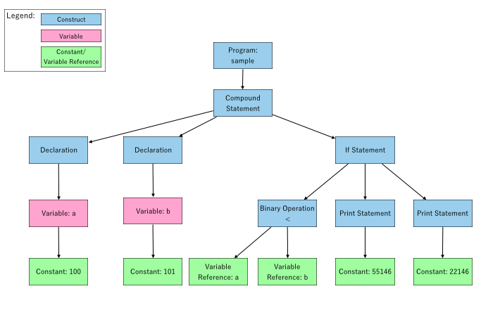
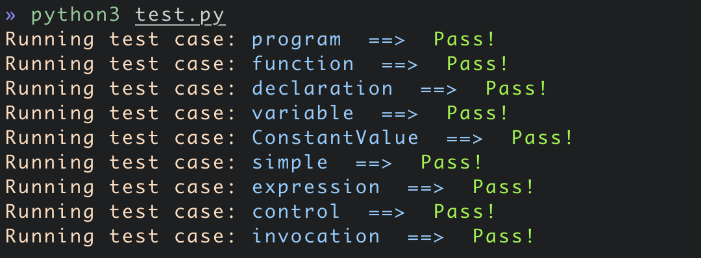
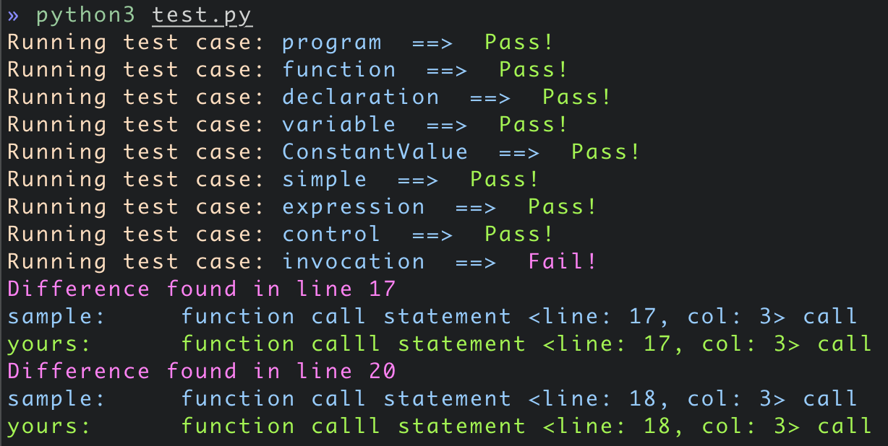

# Project Assignment 3 - Constructing Abstract Syntax Trees

**Introduction to Compiler Design by Prof. Yi-Ping You**

Due Date: **23:59, December 8, 2019**

In this assignment, you will extend your parser to construct an abstract syntax tree (AST) for a given program written in **`P`** language and to serialize this AST into the designated format.

---

**Table of Contents**
- [Project Assignment 3 - Constructing Abstract Syntax Trees](#project-assignment-3---constructing-abstract-syntax-trees)
  - [Project Description](#project-description)
      - [Using C/C++](#using-cc)
  - [Abstract Syntax Tree](#abstract-syntax-tree)
  - [Traversing ASTs Using Visitor Pattern](#traversing-asts-using-visitor-pattern)
  - [Implementation Hints](#implementation-hints)
    - [Location Infomation](#location-infomation)
    - [AST node construction](#ast-node-construction)
    - [Dumping ASTs](#dumping-asts)
    - [Recommended implementation order](#recommended-implementation-order)
  - [What Should Your Parser Do?](#what-should-your-parser-do)
  - [Project Structure](#project-structure)
  - [Assessment Rubrics (Grading)](#assessment-rubrics-grading)
  - [Build and Execute](#build-and-execute)
    - [Build Project](#build-project)
    - [Test your parser](#test-your-parser)
  - [Submitting the Assignment](#submitting-the-assignment)

---

## Project Description

#### Using C/C++

Starting from this assignment, you have the option to write your code in either `C` or `C++`. However, C++ is recommended because you can make use of the containers defined in the C++ `STL`(Standard Template Library).

In this assignment, we will use `flex(lex)` and `bison(yacc)` to compile your code.


## Abstract Syntax Tree

> You need to design and implement your AST with the guideline we provide:
> [AST-guideline.md](./ast_guideline.md).<br>
> :mag: *Read it **carefully*! Everything you need is included.*


An AST is a way of representing the syntax of a programming language as a hierarchical tree-like structure. The tree represents all of the constructs in the language and their subsequent rules. Some language constructs, such as if-else conditional and function declaration in `P` language, are made up of simpler constructs, such as variables and statements.
Consequently, the root of an AST of a program represents the entire program, and each node within the AST either has one or more children that represent its constituent parts or represents a basic construct (e.g., a constant or a variable reference) per se. Let's look at a simple example:

```pascal
sample;

begin
  var a: 100;
  var b: 101;
  if a < b then
    print 55146;
  else
    print 22146;
  end if
end
end sample
```

First, we have a program node as the root of our AST. The program node has an arbitrary number of child nodes, which can be a global (constant) variable declaration, a function declaration, or a program body, and each declaration forms a node. In this case, no declaration is made before the program body, so no declaration node is generated. The program node has only one child, which is a program body.

A program body is a compound statement node with an arbitrary number of child nodes:

- Local (constant) variable declarations
	- `var a: 100;`
	- `var b: 101;`
- Statements
	- `if ... else ... end if`

An `if` statement also has an arbitrary number of children. In this case, it has the following child nodes:

- A conditional expression
	- `a < b`
- A statement in the if body
	- `print 55146;`
- A statement in the else body
	- `print 22146;`

Here is the full AST for the aforementioned `P` program:



> You need to design and implement your AST with the guideline we provide:
> [AST-guideline.md](./ast_guideline.md).<br>
> :mag: *Read it **carefully**! Everything you need is included.*

The serialization output of your AST is also defined in that guideline.


## Traversing ASTs Using Visitor Pattern

In the next assignment, you are required to perform a semantic analysis based on the trees you built. This process contains lots of traversals of the trees, which are composed of nodes with different types, so it often makes sense to use the visitor pattern.

In this assignment, the only thing you have to do with an AST is to apply a pre-order traversal of the AST and dump every node you visit in the AST.

You are highly encouraged to adopt the visitor pattern, which would give you an extra 15 points. Also, a tutorial for you to know how to use the visitor pattern in C++ can be found below:
+ [visitor-tutorial.md](./tutorial/README.md)
> The `Visitor Pattern` is an **easy bonus** to get (with C++)


## Implementation Hints

### Location Infomation

> To use the following feature, you should use `bison` instead of `yacc`. You can use `bison` on the Linux workstation provided by Computer Center, Department of Computer Science, NCTU.

`Bison` provides a way to keep track of the textual locations of tokens and groupings. The way locations are handled in `bison` is defined by providing a data type, and actions to take when rules are matched.

**1. Data Type of Locations in `bison`**

You can specify the type of locations by defining a macro called `YYLTYPE`. When `YYLTYPE` is not defined, `bison` uses a default structure type with four members:

```c
typedef struct YYLTYPE {
    int first_line;
    int first_column;
    int last_line;
    int last_column;
} YYLTYPE;
```

You can define your own `YYLTYPE` by defining the macro `YYLTYPE` and the data structure corresponding to it:

```c
#define YYLTYPE yyltype

typedef struct YYLTYPE {
    uint32_t first_line;
    uint32_t first_column;
    uint32_t last_line;
    uint32_t last_column;
} yyltype;
```

For a minimum modification, you should keep the member name unchanged; otherwise, you will also need to fix the macro `YYLLOC_DEFAULT` in your `bison` file. (For more information, see [link 1](https://www.gnu.org/software/bison/manual/html_node/Location-Default-Action.html#Location-Default-Action) and [link 2](https://stackoverflow.com/questions/25258325/lex-yacc-get-current-position).)

**2. Actions for Setting Locations**

Before providing action in your `lex` file, you have to put `%locations` in your `yacc` file, so that `bison` can generate the header with the extern variable `yylloc` for further usage.

You should then provide an action to set the location of each token by defining the macro `YY_USER_ACTION` in `lex`. It is always executed before the action of the matched token rule.

Here is the definition of the macro `YY_USER_ACTION`:

```c
#define YY_USER_ACTION \
    yylloc.first_line = LineNum; \
    yylloc.first_column = ColNum; \
    ColNum += yyleng;
```

`yylloc` is a global variable that is declared and used by `bison`.
The data type of `yylloc` is `YYLTYPE`. We set the `yylloc` each time a token is matched, and then `bison` will store it in an internal array, which can be referred to in a grammar action.

**3. Actions for Getting Locations**

You can get the location (set by `YY_USER_ACTION`) using `@n`, which means the location of the *nth* component of the right-hand side of a production rule.

Here is an example of getting locations:

```yacc
Program:
    ProgramName SEMICOLON ProgramBody END ProgramName {
        // Use @1 and @5 to get the location of
        // program name and the name after `end`
        root = newProgramNode(@1.first_line, @1.first_column, ..., @5.first_line, @5.first_column);
    }
;
```

### AST node construction

> You need to write **yacc** actions to construct your AST.

Pseudocode for constructing an `if` node is provided below:

```c++
condition = newBinaryOp(op=">", left_operand=newVarRef("a"), right_operand=newVarRef("b"));

print = newPrintNode(target=Constant(55146));
if_body = [print];

print = newPrintNode(target=Constant(22146));
else_body = [print];

if = newIfNode(condition=condition, body=if_body, else=else_body);
```

Here are some possible approaches to implement this assignment:

You may declare the data structure of an AST node like this:

```c
struct AstNode {
    enum ASTType type;
    union {
        // Program Node
        struct {
            // TODO
        };

        // Declaration Node
        struct {
            // TODO
        };

        // ...
    };
};
```

### Dumping ASTs

+ Visitor Pattern with C++

  Read our [tutorial](./tutorial/) to get a concept of what the visitor pattern is and how to use it. After that, implement your dump-ast feature with the guideline we provide:
  + [AST-guideline.md](./ast_guideline.md).

+ Visitor Pattern with C

  If you choose to use visitor pattern with C, reading our [tutorial with C++](./tutorial/README.md) first might help. We couldn't provide you a complete tutorial, but we still give you a hint about how to do that. Here it is:
  > Hint: You may need to know how to use function pointers when implementing visitor pattern in C.

+ Switch Statement (Not recommended)

  An alternative to `Visitor Pattern` is by using `switch` statement.

  ```c
  void dumpAst(AstNode *node) {
      if (node == NULL) {
          return;
      }

      switch (node->type) {
      case PROGRAM_NODE:
          dumpProgramNode(node);
          break;
      case DECLARATION_NODE:
          dumpDeclarationNode(node);
          break;
      // ...
      }
  }
  ```
  Consequently, you may need to add another function like above to perform semantic analyses in the next assignment.

### Recommended implementation order

1. Define classes for nodes in the AST
2. Writing yacc actions to construct the AST
3. Write a visitor class to dump the AST
4. Use tree traversal to go through your AST, pass visitor to all of the nodes.

## What Should Your Parser Do?

Your parser should construct an AST, rooted at a Program node, after the execution of `yyparse()`. After that, you can dump the AST, perform semantic analyses or generate code directly upon the AST, rather than completing all the functionalities in the yacc actions.

Your parser should dump the AST when the flag `--dump-ast` is enabled. Use **pre-order traversal** while traversing your AST.

Let's look at a simple example:

```
$ ./parser test.p --dump-ast
1: //&T-
2: test;
3:
4: func( a: integer ; b: array 1 to 2 of array 2 to 4 of real ): boolean;
5: begin
6:   var c: "hello world!";
7:   begin
8:     var d: real;
9:     return (b[1][4] >= 1.0);
10:   end
11: end
12: end func
13:
14: begin
15:   var a: integer;
16:   begin
17:     var a: boolean;
18:   end
19: end
20: end test
program <line: 2, col: 1> test void
  function declaration <line: 4, col: 1> func boolean (integer, real[1][2])
    declaration <line: 4, col: 7>
      variable <line: 4, col: 7> a integer
    declaration <line: 4, col: 20>
      variable <line: 4, col: 20> b real[1...2][2...4]
    compound statement <line: 5, col: 1>
      declaration <line: 6, col: 3>
        variable <line: 6, col: 7> c string
          constant <line: 6, col: 10> "hello world!"
      compound statement <line: 7, col: 3>
        declaration <line: 8, col: 5>
          variable <line: 8, col: 9> d real
        return statement <line: 9, col: 5>
          binary operator <line: 9, col: 21> >=
            variable reference <line: 9, col: 13> b
            [
              constant <line: 9, col: 15> 1
            ]
            [
              constant <line: 9, col: 18> 4
            ]
            constant <line: 9, col: 24> 1.000000
  compound statement <line: 14, col: 1>
    declaration <line: 15, col: 3>
      variable <line: 15, col: 7> a integer
    compound statement <line: 16, col: 3>
      declaration <line: 17, col: 5>
        variable <line: 17, col: 9> a boolean

|--------------------------------|
|  There is no syntactic error!  |
|--------------------------------|
```

## Project Structure

- `README.md`
- /src
	- Makefile
	- `scanner.l`
	- `parser.y`
	- `error.h`
	- Other modules you may add
- /report
	- `README.md`

In this assignment, you have to do the following tasks:

- Revise `scanner.l`, `parser.y`, add some modules (e.g., `ast.h`, `ast.c`, etc.) to construct your AST.
- Write the report in `report/README.md`. The report should at least describe the changes you have made in `scanner.l`, `parser.y`, and the abilities of your AST.

If you want to preview your report in GitHub style markdown before pushing to GitHub, [`grip`](https://github.com/joeyespo/grip) might be the tool you need.

## Assessment Rubrics (Grading)

Total of 100 points, with 15 point available bonus points.
(115 pts is the maximum grade you could get in this assignment)

+ Passing all test cases (95 pts)
+ Report (5 pts)
+ bonus
  + using `Visitor Pattern` to dump your AST ( +15 pts)

Be careful, you will get a **50-percent** deduction if you pass **any of** our test cases without constructing an AST. 
> 分數直接砍半哦，歹路毋通走 :heart:

## Build and Execute

- Build: `cd src && make clean && make`
- Execute: `./parser [input file] --dump-ast`
- Test: `cd test && python3 test.py`

### Build Project

TA would use `src/Makefile` to build your project by simply typing `make clean && make` on CS workstation. You have to make sure that it will generate an executable named '`parser`'. **No further grading will be made if the `make` process fails or the executable '`parser`' is not found.**

### Test your parser

We provide some basic tests in the test folder. Simply `cd` to test folder and type `python3 test.py` to test your parser. You can also type `python3 test.py --help` to know what arguments you can set.

The objective we provide sample test cases is making sure your parser outputs in correct format and parses program correctly. You will get at least **95 pts** if you pass all the test cases.

Please use `student_` as the prefix of your own tests to prevent TAs from overriding your files. For example: `student_identifier_test`.

If you pass all test cases, you will get:



You will get the following output messages if your parser outputs a wrong format (A blue line with a prefix sample: shows a sample solution, and a green line with a prefix yours: is your output):



## Submitting the Assignment

You should push all your commits to the designated repository (hw3-\<Name of your GitHub account\>) under the compiler-f19 GitHub organization by the deadline (given in the very beginning of this assignment description).
At any point, you may save your work and push commits to your repository. You **must** commit your final version to the **master branch**, and we will grade the commit which is last pushed on your master branch. The **push time** of that commit will be your submission time, so you should not push any commits to the master branch after the deadline if you have finished your assignment; otherwise, you will get a late penalty.

Note that the penalty for late homework is **15% per day** (weekends count as 1 day). Late homework will not be accepted after sample codes have been posted.

In addition, homework assignments **must be individual work**. If we detect what we consider to be intentional plagiarism in any assignment, the assignment will receive reduced or, usually, **zero credit**.
